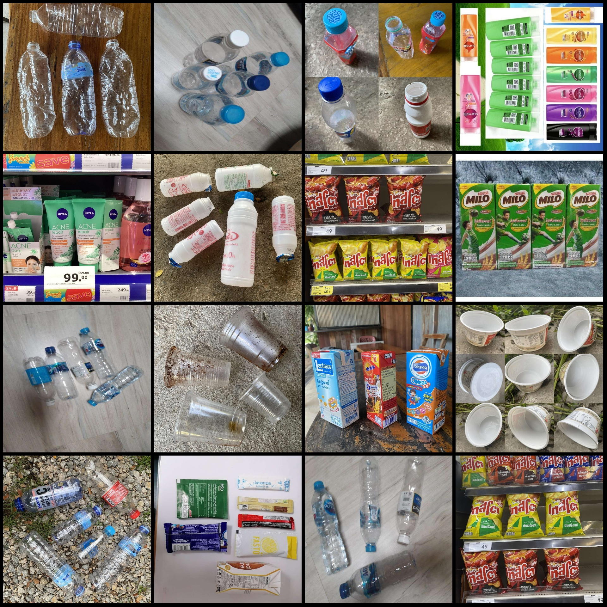
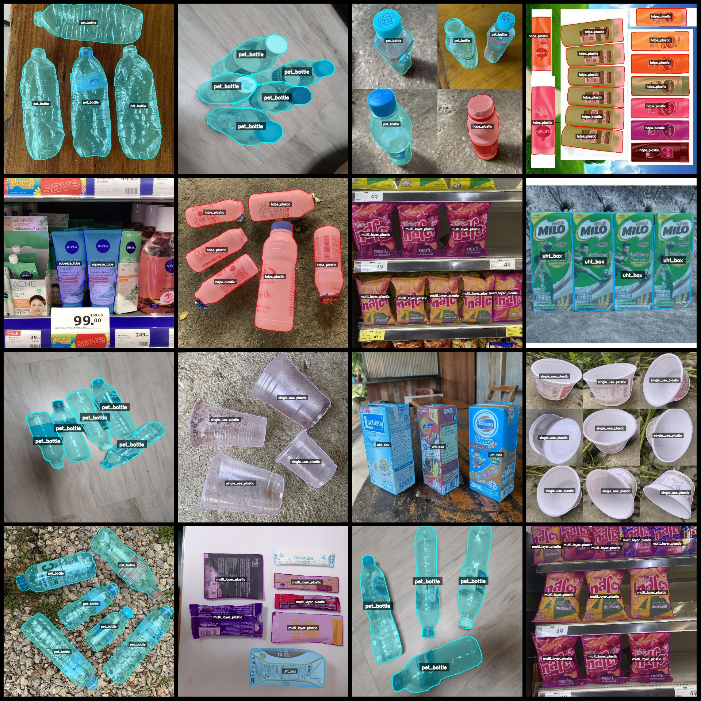
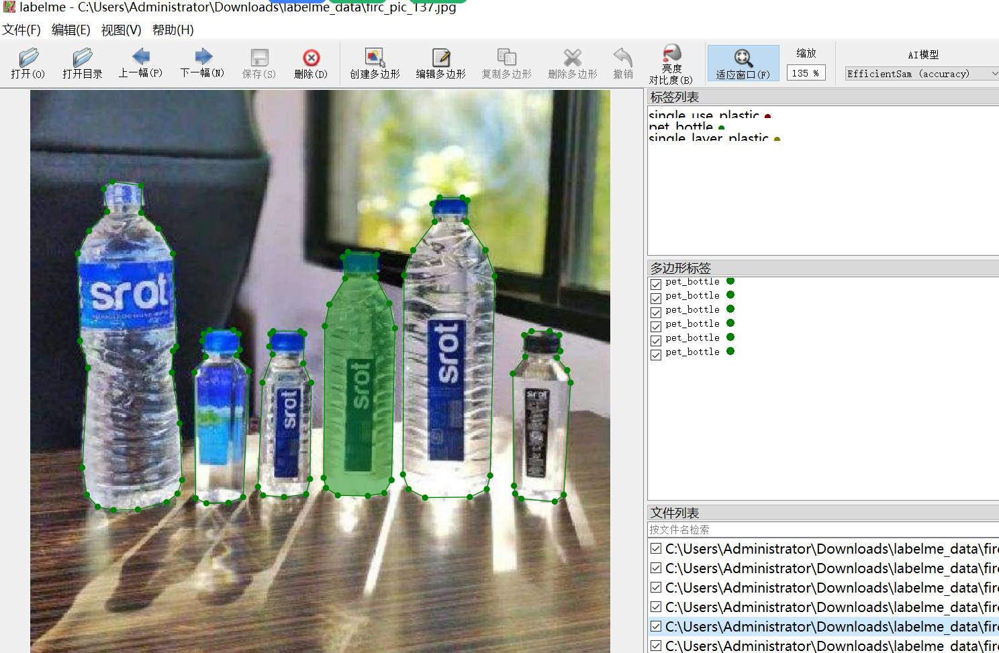

# Life Plastic Products Dataset with Various Plastic Objects Identification and Segmentation in labelme Format

The dataset format: labelme format (without mask files, just containing jpg images and corresponding json files)

Number of image files (jpg file counts): 3842
Number of annotations (json file counts): 3842
Number of annotation categories: 7
Annotation category names: ["HDPE_plastic", "Multi_Layer_plastic", "PET_bottle", "Single_Layer_plastic", "Single_use_plastic", "Squeeze_tube", "UHT_box"]
Each category number of bounding boxes:
hdpe_plastic (HDPE plastic) count = 4591
multi_layer_plastic (Multi-Layer plastic) count = 5052
pet_bottle (PET plastic bottle) count = 4839
single_layer_plastic (Single-Layer plastic) count = 4326
single_use_plastic (One-Use plastic) count = 2031
squeeze_tube (Squeeze Tube) count = 2722
uht_box (UHT Box/Hyper High-Temperature Sterilizer Box) count = 3321
Total bounding box count: 26882

Using labelme tool: labelme=5.5.0
Image resolution: 1024x1024
Annotation rules: Polygon drawing for class categories
Important note: This dataset can be edited in labelme, but the json dataset needs to be converted into mask or yolo format or coco format for instance segmentation or semantic segmentation.
Special declaration: The dataset does not guarantee the accuracy of the trained models or weight files.
Image preview:
Annotation example:
Original images (randomly select 16 images):
Annotation drawing results:

## Images

Here is a pay link on Stripe ( https://buy.stripe.com/3cs8yP7sY87d0vu9AB ). Please contact me lonlonago@foxmail.com after funding $89, and I will send you a complete data files , thank you!

